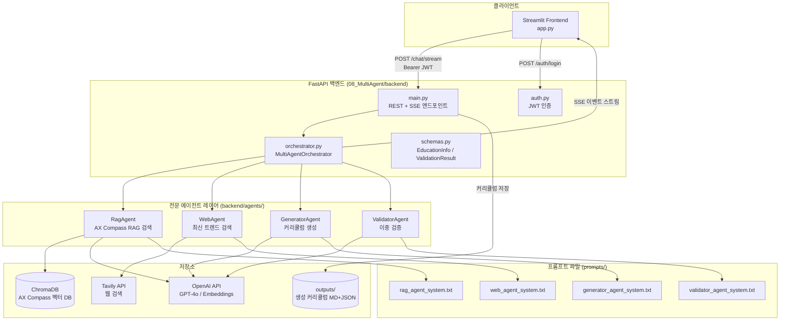
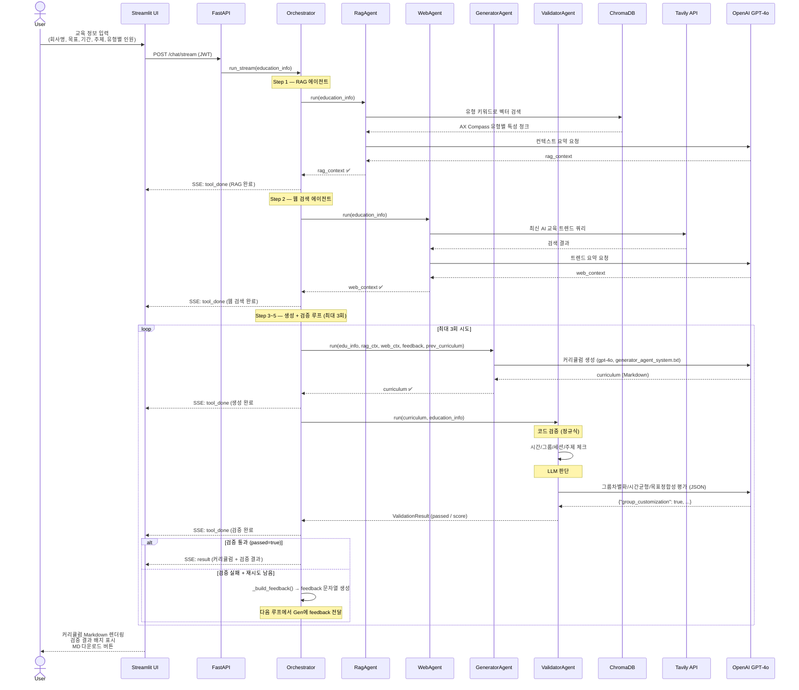
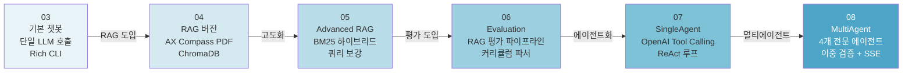

# AX Curriculum Chatbot — 프로젝트 결과보고서

> **PBL(Problem-Based Learning) 방식**으로 실제 기업 교육 현장의 문제를 발견하고, 멀티에이전트 AI 파이프라인으로 해결한 프로젝트입니다.

---

## 목차

1. [문제 정의](#1-문제-정의)
2. [해결 방향](#2-해결-방향)
3. [트레이드오프 및 설계 결정](#3-트레이드오프-및-설계-결정)
4. [시스템 아키텍처](#4-시스템-아키텍처)
5. [에이전트 파이프라인](#5-에이전트-파이프라인)
6. [프로젝트 진화 경로](#6-프로젝트-진화-경로)
7. [기술 스택](#7-기술-스택)
8. [실행 방법](#8-실행-방법)

---

## 1. 문제 정의

### 배경

기업의 AX(AI Transformation) 교육을 기획할 때 현장에서 반복적으로 발생하는 세 가지 문제를 확인했습니다.

| # | 문제 | 구체적 증상 |
|---|------|-------------|
| 1 | **단일 커리큘럼의 한계** | 같은 회사 내에도 AI 도구에 대한 이해도·동기·주의 성향이 제각각인 수강생이 섞여 있는데, 모두에게 동일한 커리큘럼을 제공하면 절반은 "너무 쉽다", 나머지 절반은 "너무 어렵다"고 이탈함 |
| 2 | **커리큘럼 설계의 전문성·시간 비용** | 교육 담당자가 수작업으로 수강생 유형을 분석하고 그룹별 실습을 설계하는 데 수 일이 소요됨. 반복 수주 시마다 재설계 필요 |
| 3 | **품질 검증 부재** | 생성된 커리큘럼이 "교육 주제를 실제로 다루는가", "이론/실습 비율이 적절한가", "그룹별 실습이 실질적으로 다른가"를 체계적으로 검증하는 기준이 없음 |

### 핵심 질문

> *"수강생의 AX 역량 유형 진단 결과를 반영하여, 그룹별로 차별화된 커리큘럼을 자동으로 생성하고 품질까지 보장할 수 있는가?"*

---

## 2. 해결 방향

### AX Compass 유형 기반 그룹화

수강생을 6가지 역량 유형으로 진단(AX Compass)하고, 학습 성향이 유사한 유형끼리 3개 그룹으로 묶어 그룹별 맞춤 실습을 설계합니다.

| 그룹 | 포함 유형 | 특성 | 실습 방식 |
|------|----------|------|-----------|
| **A그룹** | 균형형 · 이해형 | AI 활용 준비도 높고 학습 의욕 강함 | 자율 심화 프로젝트 + 팀 발표 |
| **B그룹** | 과신형 · 실행형 | 빠른 실행력, 검증 절차 미흡 | 빠른 프로토타입 → 체크리스트 검증 → 페어리뷰 |
| **C그룹** | 판단형 · 조심형 | 신중하고 심리적 장벽 높음 | 가이드 문서 기반 단계별 + 강사 즉각 피드백 |

### 멀티에이전트 파이프라인

단일 LLM 호출로 모든 것을 처리하지 않고, **역할이 명확히 분리된 4개 전문 에이전트**가 순차 협력합니다.

```
RAG 에이전트 → 웹 검색 에이전트 → 생성 에이전트 → 검증 에이전트
                                        ↑________________________|
                                        검증 실패 시 피드백 재생성 (최대 3회)
```

### 이중 검증 체계

생성된 커리큘럼을 **규칙 기반(코드 검증)**과 **LLM 판단(정성 평가)** 두 층으로 검증합니다.

| 검증 층 | 항목 | 방법 |
|---------|------|------|
| 코드 검증 | 총 시간, A/B/C 그룹 존재, 세션 수, 주제 커버리지 | 정규식 + 집계 |
| LLM 판단 | 그룹별 실습 차별화, 이론/실습 균형, 교육 목표 정합성 | GPT-4o JSON 출력 |

---

## 3. 트레이드오프 및 설계 결정

### 3-1. 멀티에이전트 vs. 단일 LLM 호출

| 항목 | 단일 LLM | 멀티에이전트 (채택) |
|------|---------|------------------|
| 응답 속도 | 빠름 (1회 호출) | 느림 (4회 이상 호출) |
| 구현 복잡도 | 낮음 | 높음 |
| 컨텍스트 품질 | 프롬프트 하나에 모든 정보 | 각 에이전트가 전문 정보만 처리 |
| 재시도 유연성 | 전체 재생성 | 생성·검증만 선택적 재시도 |
| 품질 보증 | 없음 | 이중 검증 루프 |

**채택 이유**: 커리큘럼 품질이 핵심 요구사항이었기 때문에 속도보다 정확도를 우선. 검증 실패 시 RAG/웹 검색을 재실행하지 않고 생성-검증 루프만 반복함으로써 API 비용을 최소화했습니다.

### 3-2. 규칙 기반 검증 vs. LLM 전용 검증

| 항목 | LLM 전용 검증 | 규칙 + LLM 혼합 (채택) |
|------|-------------|----------------------|
| 구현 비용 | 낮음 | 중간 |
| 결정론적 보장 | 없음 (확률적) | 있음 (정규식 항목) |
| 비용 | 높음 | 낮음 (LLM 호출 최소화) |
| 피드백 구체성 | 모호할 수 있음 | 구체적 수정 지시 가능 |

**채택 이유**: "총 시간이 명시됐는가", "A/B/C 그룹이 모두 존재하는가"처럼 정규식으로 확실히 판단 가능한 항목은 LLM에 넘기지 않아 비용과 불확실성을 줄였습니다. LLM은 정성적 판단(그룹 차별화 실질성, 목표 정합성)에만 사용합니다.

### 3-3. ChromaDB(로컬) vs. 외부 벡터 DB

| 항목 | 외부 벡터 DB | ChromaDB 로컬 (채택) |
|------|------------|---------------------|
| 확장성 | 높음 | 단일 서버 한계 |
| 운영 복잡도 | 높음 | 낮음 (파일 기반) |
| 지연시간 | 네트워크 의존 | 없음 |
| 데이터 고정성 | 동적 업데이트 용이 | 배포 시 임베딩 재생성 필요 |

**채택 이유**: AX Compass 유형 데이터(6가지 유형, PDF 1개)는 변경이 거의 없는 소규모 정적 데이터입니다. 외부 서비스 의존성을 줄이고 개발 속도를 높이기 위해 로컬 ChromaDB를 선택했습니다.

### 3-4. SSE 스트리밍 vs. 폴링

| 항목 | 폴링 | SSE 스트리밍 (채택) |
|------|------|-------------------|
| 구현 복잡도 | 낮음 | 중간 |
| 서버 부하 | 높음 (반복 요청) | 낮음 (단일 연결 유지) |
| UX | 진행 상태 불투명 | 각 에이전트 완료 즉시 표시 |

**채택 이유**: 커리큘럼 생성은 2~3분 소요됩니다. 사용자가 진행 상태를 실시간으로 볼 수 없으면 응답이 온 것인지 오류가 난 것인지 구분할 수 없습니다. SSE로 각 에이전트 완료 시점마다 이벤트를 전송해 UX를 크게 개선했습니다.

### 3-5. 프롬프트 파일 외부화 vs. 코드 내 하드코딩

**채택**: 외부 `.txt` 파일 방식

**이유**: 프롬프트는 코드보다 훨씬 자주 수정됩니다. 코드 배포 없이 프롬프트만 교체할 수 있어야 빠른 품질 개선이 가능합니다. 검증 기준(validator_agent_system.txt)과 생성 규칙(generator_agent_system.txt)을 코드와 분리하면 도메인 전문가가 직접 수정할 수 있습니다.

---

## 4. 시스템 아키텍처



### 계층 설명

| 계층 | 역할 |
|------|------|
| **Streamlit UI** | 교육 정보 입력 폼, SSE 실시간 진행 표시, 커리큘럼 Markdown 렌더링 및 다운로드 |
| **FastAPI** | JWT 인증, REST API(`/auth`, `/health`, `/curricula`), SSE 스트리밍(`/chat/stream`) |
| **Orchestrator** | 에이전트 순서 제어, 상태 추적(`OrchestratorState`), 검증 실패 피드백 생성, SSE 이벤트 발행 |
| **Agent Layer** | 각 에이전트는 단일 책임 — 입력 받아 결과 반환, LLM 호출 캡슐화 |
| **Storage** | ChromaDB(벡터), Tavily(웹), OpenAI(LLM/Embedding), 로컬 파일(결과 저장) |

---

## 5. 에이전트 파이프라인



### 검증 점수 산정

```
최종 점수 = 코드 검증 70% + LLM 판단 30%

코드 검증 (각 25%):
  ① 총 시간 명시 여부
  ② A/B/C 그룹 모두 존재
  ③ 세션/모듈 1개 이상
  ④ 교육 주제 커버리지 (30% 이상 키워드 매칭)

LLM 판단 (각 33.3%):
  ① 그룹별 실습 실질적 차별화
  ② 이론(50~60%) / 실습(40~50%) 시간 균형
  ③ 교육 목표 정합성
```

### 재시도 피드백 전달 구조

검증 실패 시 오케스트레이터가 실패 항목별 구체적 수정 지시를 생성하여 다음 생성 시도에 전달합니다.

```
[검증 실패 — 다음 항목을 반드시 수정하세요]
• [내용] 누락된 주제(보안 및 개인정보 보호)를 세션 내용에 포함하세요.
• [품질] A/B/C그룹 실습을 실질적으로 차별화하세요 — 접근법·과제·방식이 달라야 합니다.
```

---

## 6. 프로젝트 진화 경로

이 프로젝트는 단계적으로 기능을 확장하며 구현했습니다.



| 단계 | 핵심 추가 기능 |
|------|--------------|
| 03 기본 챗봇 | GPT-4o 단일 호출, Rich CLI 터미널 UI |
| 04 RAG | AX Compass PDF → ChromaDB 임베딩, 유형별 맞춤 실습 설계 |
| 05 Advanced RAG | BM25 + 벡터 하이브리드 검색, 쿼리 보강(HyDE 변형) |
| 06 Evaluation | RAG 평가 파이프라인, 커리큘럼 품질 파서 |
| 07 SingleAgent | OpenAI Tool Calling 기반 ReAct 에이전트, 스트리밍 UI |
| 08 MultiAgent | 역할 분리 4-에이전트, 이중 검증 루프, JWT 인증, SSE API |

---

## 7. 기술 스택

| 분류 | 기술 | 용도 |
|------|------|------|
| **LLM** | GPT-4o (OpenAI) | 커리큘럼 생성, LLM 검증 판단, 컨텍스트 요약 |
| **Embedding** | text-embedding-3-small | AX Compass 문서 벡터화 |
| **Vector DB** | ChromaDB (로컬 Persistent) | AX Compass 유형별 특성 검색 |
| **하이브리드 검색** | rank-bm25 + ChromaDB | BM25 + 벡터 혼합 검색 |
| **웹 검색** | Tavily API | 최신 AI 교육 트렌드 수집 |
| **백엔드** | FastAPI + Uvicorn | REST API + SSE 스트리밍 |
| **인증** | PyJWT | Bearer 토큰 인증 |
| **프론트엔드** | Streamlit | 교육 정보 입력 UI, 커리큘럼 렌더링 |
| **스키마** | Pydantic v2 | 요청/응답/검증 결과 타입 보장 |

---

## 8. 실행 방법

### 환경 설정

```bash
# 08_MultiAgent/.env 설정
OPENAI_API_KEY=sk-...
TAVILY_API_KEY=tvly-...       # 선택 (없으면 웹 검색 스킵)
ADMIN_USERNAME=admin
ADMIN_PASSWORD=<sha256_hash>  # echo -n "password" | sha256sum
JWT_SECRET_KEY=your-secret-key
AGENT_MODEL=gpt-4o
GEN_MODEL=gpt-4o
OUTPUTS_DIR=./outputs
```

### 백엔드 실행

```bash
cd 08_MultiAgent
pip install -r backend/requirements.txt
python run_backend.py          # http://localhost:8000
```

### 프론트엔드 실행

```bash
cd 08_MultiAgent/frontend
pip install streamlit
streamlit run app.py           # http://localhost:8501
```

### API 직접 사용

```bash
# 1. 토큰 발급
TOKEN=$(curl -s -X POST http://localhost:8000/auth/login \
  -H "Content-Type: application/json" \
  -d '{"username":"admin","password":"admin"}' | jq -r .access_token)

# 2. 커리큘럼 생성 (SSE 스트리밍)
curl -N http://localhost:8000/chat/stream \
  -H "Authorization: Bearer $TOKEN" \
  -H "Content-Type: application/json" \
  -d '{
    "messages": [{"role":"user","content":"커리큘럼 생성"}],
    "education_info": {
      "company": "헬로월드랩스",
      "goal": "AX 도구를 활용한 업무 자동화 역량 강화",
      "audience": "개발자 및 비개발자 혼합",
      "level": "초중급",
      "duration": "3일 8시간씩",
      "topics": ["AI 도구 소개 및 활용법", "업무 자동화 워크플로우 설계", "보안 및 개인정보 보호"],
      "extra": "",
      "type_counts": {"균형형":5,"이해형":5,"과신형":3,"실행형":7,"판단형":5,"조심형":5}
    }
  }'
```

### API 엔드포인트 목록

| Method | Path | 설명 |
|--------|------|------|
| `POST` | `/auth/login` | 로그인 → JWT 발급 |
| `GET` | `/auth/verify` | 토큰 유효성 확인 |
| `GET` | `/health` | 서버 상태 확인 |
| `POST` | `/chat/stream` | 커리큘럼 생성 (SSE) |
| `GET` | `/curricula` | 생성 이력 목록 |
| `GET` | `/curricula/{id}/download` | 커리큘럼 MD 다운로드 |

---

## 라이선스

MIT
